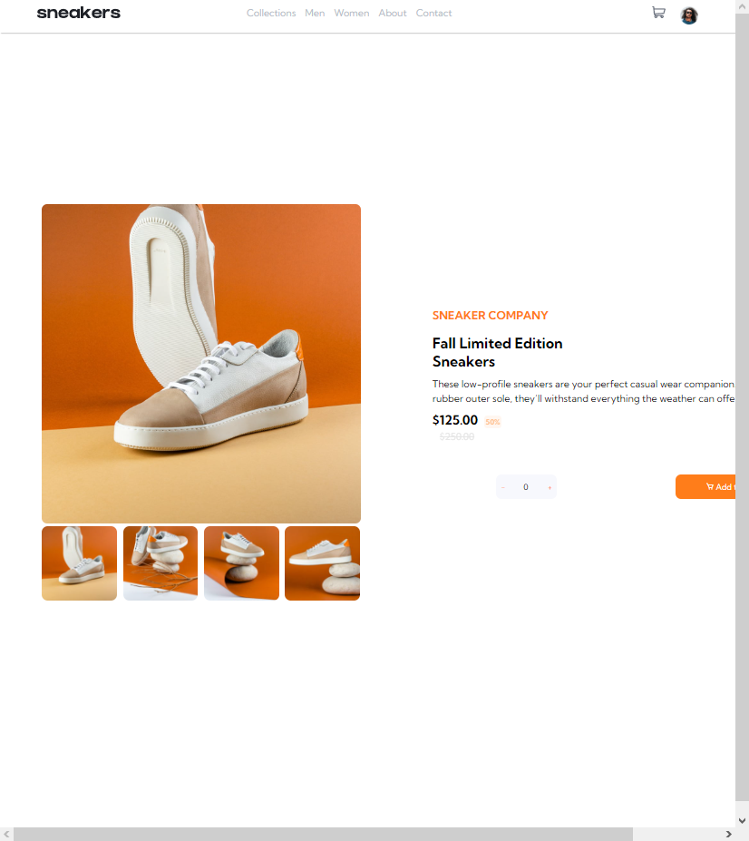

# Frontend Mentor - E-commerce product page

## Bem-vindo! 👋

Obrigado por conferir minha resolução para o desafio de e-commerce product page do [Frontend Mentor](https://www.frontendmentor.io).

## Linguagens utilizadas 🚀

Neste desafio, foram utilizadas as linguagens de:

• HTML; 
• CSS; 
• JavaScript;

## O projeto

Trata-se de um projeto de landing page comercial de uma loja de moda, com enfase na compra de um par de tenis. Pode-se realizar o preview das imagens thumbnail ao clicar nelas, e pode-se também efetuar o numero de produtos que deseja comprar.

## Aprendizado

Durante a elaboração deste desafio, fui capaz de desenvolver minhas habilidades em HTML, CSS e JavaScript. Passei por dificuldades com o JavaScript por ser uma tecnologia nova para mim. Mas, sem dúvida, me senti realizado elaborando este projeto pois pude sentir minhas habilidades evoluindo.

## Contato

Caso deseje comunicar-se comigo, aqui vão meus contatos:

- [Linkedin](https://www.linkedin.com/in/viniciuspereiraalves/)
- [Email](engenheiro.viniciusp@gmail.com)

##Isso é tudo por hoje, fico imensamente grato pela sua atenção! 🚀
